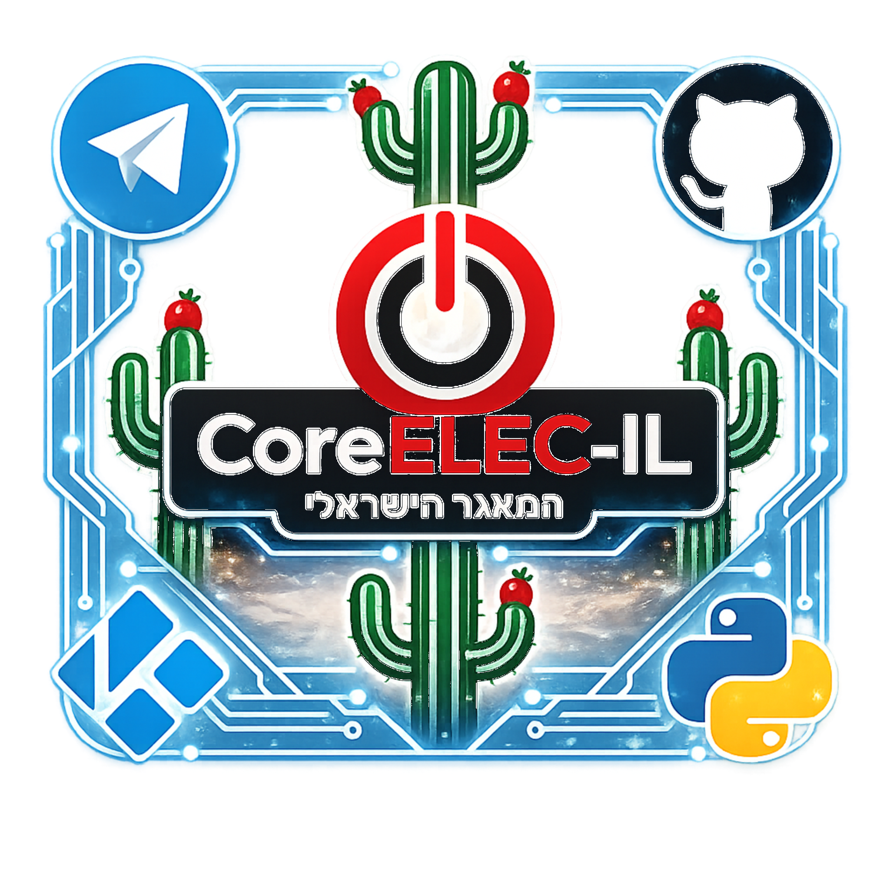

<a href="README.md">🇮🇱 עברית</a> | <a href="README.en.md">🇬🇧 English</a>

# 🌵 CoreELEC-IL

### המאגר הישראלי ל-Kodi / CoreELEC

**הבית של תוספים שנכתבו מתוך אהבה ליציבות, ביצועים וקוד נקי.**

&nbsp;&nbsp;

&nbsp;&nbsp;

&nbsp;&nbsp;

&nbsp;&nbsp;

---

### 📑 ניווט מהיר

**[🎯 החזון](#-החזון)** &nbsp;•&nbsp; **[📥 הורדה](#-איך-מורידים)** &nbsp;•&nbsp; **[<bdi dir="ltr">🔍 AutoCompletion</bdi>](#-autocompletion-coreelec-il-edition)** &nbsp;•&nbsp; **[🛡️ Safe Boot Manager](#️-safe-boot-manager-coreelec-il-exclusive)** &nbsp;•&nbsp; **[🌱 קוד פתוח ותרומה](#-קוד-פתוח-ונפש-חפצה)**

---

 

&nbsp;&nbsp;&nbsp;&nbsp;&nbsp;&nbsp;&nbsp;&nbsp;&nbsp;&nbsp;&nbsp;&nbsp;&nbsp;&nbsp;&nbsp;&nbsp;&nbsp;&nbsp;&nbsp;&nbsp; &nbsp;&nbsp;<b>מי אני?</b>&nbsp;&nbsp;&nbsp;&nbsp;&nbsp;&nbsp;&nbsp;&nbsp;&nbsp;&nbsp;&nbsp;&nbsp;&nbsp;&nbsp;&nbsp;&nbsp;&nbsp;&nbsp;&nbsp;&nbsp;

---
 

אני מפתח עצמאי — One-Man Show 🎬 — חובב טכנולוגיה וקהילת ה-Kodi. הכל התחיל פשוט כסקרנות: "איך זה עובד שם מאחורי הקלעים?". הסקרנות הזו לקחה אותי להתחיל לחקור את קודי — בהתחלה מעיצוב ממשק בקודי, ועד חפירה מאחורי הקלעים איך Kodi עובד. התחלתי ללמוד עצמאית Python, ומאז אני לא מפסיק לבנות.

כל מה שתמצאו כאן נולד מצורך אמיתי — לא פיצ'ר בשביל פיצ'ר, אלא פתרון לבעיה שבאמת הציקה לי ביום-יום. את הריפו הזה פתחתי כי רציתי מקום אחד, אמין ועדכני, שמרכז את כל הכלים שבניתי לקהילת ה-Kodi הישראלית — בלי שיווק, בלי הבטחות ריקות, רק קוד שעובד.

**שלוש מילים שמנחות אותי:**

🧘 **יציבות** — תוסף טוב הוא כזה שלא מרגישים בקיומו

🛠️ **מאפס** — בלי תלויות מיותרות ובאגים של צד-ג'

⚡ **ביצועים** — רץ חלק גם על חומרה צנועה

---

# 🎯 החזון

בלי עדכונים בשביל "להעלות מספר". כל גרסה שיוצאת — נבדקה, נבחנה, והוכיחה שהיא משפרת את החוויה. נקודה.

💡 למה אין כאן  ?
> כי Build-ים נוטים להיות כבדים, עמוסים, ונשברים אחרי כל עדכון. אני מעדיף לתת לכם כלים יציבים ומודולריים — ואתם תבנו מהם את החוויה שלכם, על בסיס נקי ומהיר.
---

[⬆️ חזרה לניווט המהיר](#-ניווט-מהיר)

---

 # 📥 איך מורידים?

 

**דרך קודי (מומלץ):**
הוסיפו את כתובת המאגר כ-Source חדש ב-Kodi → Add-ons → Install from repository, תעתיקו את כתובת הקישור, תאשרו — ועכשיו לכו להתקנה מקובץ ZIP, יופיע לכם הריפו, תתקינו. אחרי ההתקנה אתם מחוברים לריפו ✅
<table>
<tr>
<td align="right"><b>הריפו:</b></td>
<td align="left"></td>
<td align="left"><code>https://kicking-bird-py.github.io/ce-il/</code></td>
</tr>
<tr>
<td align="right"><b>אפשרות ב׳ — דרך גלישה לאתר:</b> גלשו לאתר והורידו את הריפו כקובץ ZIP</td>
<td align="left"></td>
<td align="left"><code>https://kicking-bird-py.github.io/ce-il/</code></td>
</tr>
<tr>
<td align="right"><b>אפשרות ג׳ — דרך Git:</b></td>
<td align="left"></td>
<td align="left"><code>git clone https://github.com/kicking-bird-py/coreelec-il.git</code></td>
</tr>
</table>
 

---

[⬆️ חזרה לניווט המהיר](#-ניווט-מהיר)

---

# 🧩 התוספים שבניתי

---

 

`v3.0.1` 🟢 &nbsp;•&nbsp; [📦 הורדת ZIP](https://github.com/kicking-bird-py/coreelec-il/tree/main/zips/plugin.program.autocompletion) &nbsp;•&nbsp; [📂 קוד מקור](https://github.com/kicking-bird-py/coreelec-il/tree/main/src/plugin.program.autocompletion)

---

### 🔍 AutoCompletion `[CoreELEC-IL Edition]`

---
 

> תוסף השלמה אוטומטית לחיפוש תוכן שהופך את החיפוש ב-Kodi לחכם ומדויק יותר.

 **תאימות מלאה:** עובד בצורה מושלמת על Kodi גרסה 21 ומעלה, ומותאם במלואו לעבודה עם הגרסאות החדשות ביותר.

 **חיפוש חכם (Clean Search):** המערכת מנקה באופן אוטומטי מילים מיותרות מהחיפוש (כמו "עונה", "פרק", "איכות", "סרט" וכו'). אם תחפשו למשל "הבורר עונה 1", המערכת תבין שאתם מחפשים את "הבורר" ותבצע את החיפוש המדויק ללא מילות הרעש, גם בעברית וגם באנגלית.

> 💡 **חוויית שימוש:** כשמתחילים להקליד ומשתמשים בהשלמה האוטומטית, יתכן שתראו שהטקסט לא ממשיך להיכתב בשורת החיפוש — אין צורך להתרגש! זה אומר שהמערכת כבר "תפסה" את המונח ומבצעת את החיפוש עבורכם מאחורי הקלעים באופן מיידי.

🗂️ **זיכרון מקומי:** גישה מהירה לחיפושים אחרונים.

🔄 **ממשק מותאם:** תמיכה מלאה ב-RTL (כיוון כתיבה מימין לשמאל).

⏱️ **יציבות:** ניהול זמן המתנה (Timeout) למניעת קפיאות.

 

<b>⚙️ מפרט טכני ושיפורים (CoreELEC-IL Rewrite) — לחצו להרחבה</b>

התוסף מבוסס במקורו על עבודתו של Philipp Temminghoff 🌱, אך עבר שכתוב מקיף ומעמיק כדי להתאים לסטנדרטים המודרניים של Kodi ו-CoreELEC:

**התאמה מלאה ל-:** התאמה מלאה לסביבות עבודה מודרניות (החל מ- ומעלה), המבטיחה תאימות לכל הגרסאות הנוכחיות.

**מנוע חיפוש עצמאי 🔍:** בשונה מההרחבה המקורית של Philipp — שהתבססה על ספריות חיצוניות (כמו `requests` ותלויות צד-ג') שסבלו מחוסר עדכונים ומבסיס קוד ישן של Python 2 — גרסת ה-CoreELEC-IL מבוססת על מנוע עצמאי לחלוטין.

**חוויית "הכל כלול" 📦:** היופי בהרחבה זו הוא שהכל נמצא תחת קורת גג אחת. בניגוד לגרסה המקורית שדרשה התקנה של תוספי תלות (Dependencies) חיצוניים ומסורבלים, כאן המערכת נשענת על הספריות המובנות שכבר מותקנות ב-Kodi שלכם.

**תאימות רוחבית 🌐:** בזכות המבנה העצמאי, התוסף מבטיח תמיכה מלאה וביצועים מעולים בכל פלטפורמה (📦 CoreELEC, 🤖 Android, 🪟 Windows, 🐧 Linux) או כל מערכת הפעלה אחרת שמריצה Kodi.

**התוצאה ✨:** נמנעה האיטיות המובנית בחיפוש וכן בעיית החזרת התוצאות השגויות שאפיינה את הגרסה הקודמת. המערכת כעת קלה, יציבה ומהירה משמעותית.

**נדרש סקין תומך 🎨:** התוסף דורש סקין (Skin) התומך בחיפוש מותאם אישית כדי להציג את תוצאות ההשלמה האוטומטית בצורה תקינה (כגון Estuary או סקינים המבוססים עליו).

> ⚠️ **הערה חשובה:** בחלק מהסקינים יש לוודא בהגדרות הסקין שהאופציה לתוסף "השלמה אוטומטית" (AutoCompletion) מופעלת, ולוודא שנבחר ה-Provider המתאים עבור "CoreELEC-IL".

🆕 **מה חדש ב-`v3.0.1`:** פתרון באג בניקוי מילות חיפוש ובעיית תווים נשארים.

 

---
[⬆️ חזרה לניווט המהיר](#-ניווט-מהיר)

---

  

`v1.0.5` 🟢 &nbsp;•&nbsp; [📦 הורדת ZIP](https://github.com/kicking-bird-py/coreelec-il/tree/main/zips/service.safeboot.manager) &nbsp;•&nbsp; [📂 קוד מקור](https://github.com/kicking-bird-py/coreelec-il/tree/main/src/service.safeboot.manager)

---

### 🛡️ Safe Boot Manager `[CoreELEC-IL Exclusive]`

---

 

> התוסף ששומר על המערכת שלך חלקה ויציבה — מהרגע שהיא עולה ועד לרגע הכיבוי.

Safe Boot Manager 🧠: הוא פיתוח מקורי ובלעדי שלי, שנכתב מהיסוד (From Scratch). הצורך בו נולד מתוך התמודדות עם מערכות הפעלה "רזות" (Lightweight OS) כגון LibreELEC ו-CoreELEC, הידועות ברגישותן הגבוהה לשינויים הקטנים ביותר במערכת. באותן מערכות, לחיצות שלט מרובות או עומסי רגע בזמן עלייה עלולים להוביל לתקיעות או לקריסות, ולכן פיתחתי את התוסף כמנגנון הגנה אקטיבי שמוודא שהמערכת נשארת יציבה בכל רגע נתון.

 

 ⚖️ **חשוב מכך:** התוסף פותר את הדילמה המוכרת מול סקינים "כבדים" — לא משנה באיזה סקין בחרת להשתמש, Safe Boot Manager יודע לנהל את המשאבים של הסטרימר שלך בצורה אופטימלית, כך שחוויית השימוש נשארת חלקה, מהירה ונטולת גמגומים גם תחת עומס גרפי.

<b>⚙️ מפרט טכני ושיפורים — לחצו להרחבה</b>

 

**מנגנון הגנה בהפעלת קודי**

🔒 מונע לחיצות שלט מיותרות בזמן עליית המערכת על ידי הצגת ממשק חוסם עד להשלמת הטעינה.

🧹 ביצוע ניקוי אוטומטי של קבצים זמניים בכל הפעלה, תוך שמירה על קבצי מערכת קריטיים כמו קבצי לוג וממשק.

⏳ המתנה אוטומטית ליציבות המערכת (מניעת עומס בזמן סריקות ספריה או PVR) לפני שחרור הנעילה למשתמש.

**שמירה על יציבות 🧘**

📡 ניטור רציף של המערכת; כאשר מזוהה עומס (סריקת ספריית וידאו, סריקת PVR או חלון "Busy"), המערכת מפעילה באופן אוטומטי ממשק חוסם למניעת שיבושים.

**חוויית צפייה משודרגת 🎬**

🔙 מנגנון מבוסס רקע המזהה 3 לחיצות על כפתור ה-"חזור" בתוך שנייה אחת. המערכת מבצעת יציאה מהנגן בצורה עצמאית ומבוקרת — ניתן לראות את הנגן נסגר בצורה חלקה. הפיצ'ר הזה פוטר אותך מהמאמץ המיותר לחפש בכל פעם מחדש היכן נמצא כפתור ה"סטופ" כדי לעצור את הניגון.

🌀 הודעות טעינה חכמות המופיעות בזמן התחלת סרט/סדרה ועם סיום הניגון, ליצירת חוויה ויזואלית רציפה.

**🔐 ניהול אבטחה, פרטיות וסנכרון ספקים**

🔗 **סנכרון חכם:** מהרגע שהתקנת את ההרחבה, היא מבצעת סריקה ומזהה אוטומטית את ספקי השירות שלך (Trakt, TorBox, AllDebrid, Real-Debrid, Premiumize, EasyNews). במקום לחפש ידנית איך להגדיר כל ספק, התוסף מציע לך את חיבורי הספקים באופן אקטיבי בהגדרות התוסף, אשר נפתחות בסיום ההתקנה. ניתן לבטל או להפעיל כל ספק בקלות בחלון ההגדרות, אך חובה להפעיל את קודי מחדש כדי שהשינויים ייכנסו לתוקף.

> 🔴💡 **שימו לב:** התוסף נבנה לעבודה מול ההרחבה POV ומשתמש בה כדי לשלוח את החיפוש לסקרייפרים. מומלץ להתקין את POV כדי שהתוסף יפעל בצורה מיטבית.

🥷 **מנגנון הסתרת Token:** פיתוח ייחודי שמוודא ששום Token גישה (API Token) מלא לא נכתב לקובץ הלוג. רק 4 התווים האחרונים מוצגים לצורכי זיהוי, מה שמונע חשיפת פרטי הזדהות בעת שיתוף לוגים (Log Sharing).

✅ **בדיקת תקינות:** עבור כל ספק שבחרתם, התוסף בודק אוטומטית בכל הפעלה אם אתם מחוברים, ומציג לכם חיווי ויזואלי ברור — מחובר או לא מחובר — עם הצעת חיבור מהיר במידה וחסר Token.

**🎨 ממשק משתמש**

🪶 **עיצוב קל משקל:** יצירה דינמית של אלמנטים גרפיים המבטיחה עבודה תקינה בכל סקין.

🚫 **חסימה אקטיבית:** מנגנון מובנה המונע העברת לחיצות שלט למערכת בזמן שהממשק פעיל.

📊 **חיווי התקדמות:** הצגת אחוזי התקדמות ושמות תהליכים (בדיקת ספקים, ניקוי זמני, המתנה למערכת).

**🛡️ אבטחת איכות ופיתוח**

🔬 מאחורי התוסף הזה מושקעים מעל חודשיים של פיתוח אינטנסיבי וכתיבת קוד מאפס על ידי. כל שורה עברה בדיקות מעבדה קפדניות על גבי סטרימר מסוג Homatics 4K Box כדי להבטיח ביצועים מושלמים ותאימות מלאה לחומרה. כל עדכון שמשוחרר למאגר ה-GitHub עובר סדרת בדיקות ביצועים מקיפה ויסודית לפני השחרור לציבור. מדיניות זו נועדה להבטיח שהתוסף יציב ומהימן ללא פשרות. לכן, אין תדירות עדכונים דחופים או אגרסיביים — אני בוחר בגישה של יציבות מוחלטת ואמינות לאורך זמן על פני שינויים תכופים.

🆕 **מה חדש ב-`v1.0.5`:** תיקוני באגים בתרגום ועדכון קובץ ההגדרות.

פיתוח מקורי מאפס — ללא תלויות חיצוניות, יציב ומהיר.

 

---

[⬆️ חזרה לניווט המהיר](#-ניווט-מהיר)

---

 

# 🌱 קוד פתוח, ונפש חפצה

כל תוסף כאן משוחרר תחת **GPL-3.0**. למדו, שתפו, השתמשו — ואם הקוד שלי עזר לכם, קרדיט הוגן הוא הדלק שמניע אותי להמשיך 🔥

🐛 מצאתם באג? פתחו **Issue** ב-

⭐ אהבתם? תנו **כוכב** לפרויקט

☕ רוצים לפנק? הזמינו אותי לקפה וירטואלי ב-

💳 מעדיפים PayPal? אפשר לתרום גם ב-

---
[⬆️ חזרה לניווט המהיר](#-ניווט-מהיר)

---

### פיתוח מקורי מהיסוד — פשוט, יציב, נקי. 🌵

נבנה באהבה רבה על ידי: **kicking-bird-py**

---

